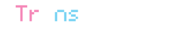
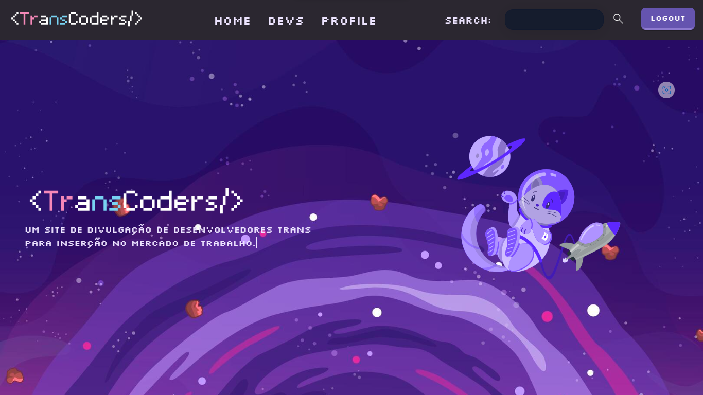
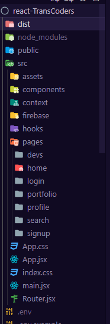

# Projeto TransCoders

Olá! esse é o projeto TransCoders. É meu projeto final do Bootcamp de Front-End da Reprograma. Ele foi feito pensando em facilitar a entrada de devs trans no mercado de trabalho através de um portal de divulgação. Quero muito levar esse projeto para frente, então se você é um dev trans pode se cadastrar no site, se você é uma empresa querendo trazer mais diversidade pro seu time, dê uma olhada nos devs cadastrados e se você quer ajudar a levar esse projeto pra frente se sinta livre a forkar o projeto e entrar em contato comigo :)

[Link para o site](https://transcoders.netlify.app/)

# Páginas, componentes e rotas
Atualmente o site possui as paginas: Home, Devs, a pagina do portfolio individual de cada dev, as paginas de login, signup e de update de perfil e a pagina de pesquisa que está em desenvolvimento

# Tecnologias usadas no projeto

O TransCoders foi desenvolvido com as seguintes tecnologias:

- [x] **ReactJS** Foi a tecnologia escolhida para criar o site
- [x] - [x] **Vite** Ferramenta de estrutura utilizada com react;
- [x] **Axios**  É usado para consumir a api do github e mostrar os projetos de cada dev na pagina individual
- [x] **Firebase** É usado para autenticação, armazenamento de dados de usuários e imagens, basicamente todo o back-end

- [x] **NPM** Gerenciador de pacotes utilizado no projeto;
- [x] **React router dom** Dependência de rotas do React
- [x] **React-select** Biblioteca para criar elementos select de forma mais flexivel.
- [x] **React-Multi-Carousel** Bilblioteca usada para criar o carrosel de linguagens na pagina individual

- [x] **Netlify**  É utilizado para Hospedagem

 
# Como rodar o projeto localmente
Siga o passo a passo a seguir:
<table>
  <thead>
<th>Passo	</th>
<th>Comando</th>
  </thead>
    <tbody>
    <tr>
      <td>Faça o fork do projeto</td>
	    <td>botão de forkar</td>
    </tr>
      <tr>
      <td>Faça o clone do projeto</td>
	    <td>git clone</td>
    </tr>
	 <tr>
      <td>Instale as dependências após acessar a pasta projeto</td>
	    <td>npm i</td>
    </tr>
    <tr>
      <td>Crie as variaveis de ambiente para integrar com Firebase e inclua os valores da sua conta	conforme</td>
	    <td> Conforme .env.example do projeto</td>
    </tr>
   <tr>
      <td>Rode o projeto na sua máquina</td>
	    <td> npm run dev</td>
    </tr>	
    </table>

# Quem sou eu?

Olá, meu nome é Mia Luz, sou uma dev trans e autista apaixonada por front-end, tô sempre estudando cada vez mais e quero um dia me tornar fullstack. Um dos meus sonhos é conseguir mudar um pouquinho o mundo através da programação, como eu quero que aconteça com esse projeto :)

# Me encontre nesses lugares

Ficou interessado no projeto, tem alguma dúvida ou quer colaborar com ele? Se conecte comigo nessas redes:

- [E-mail](mialuzazevedo@gmail.com)
- [LinkedIn](https://www.linkedin.com/in/mialuzmia/)
- [GitHub](https://github.com/mialuzmia)
